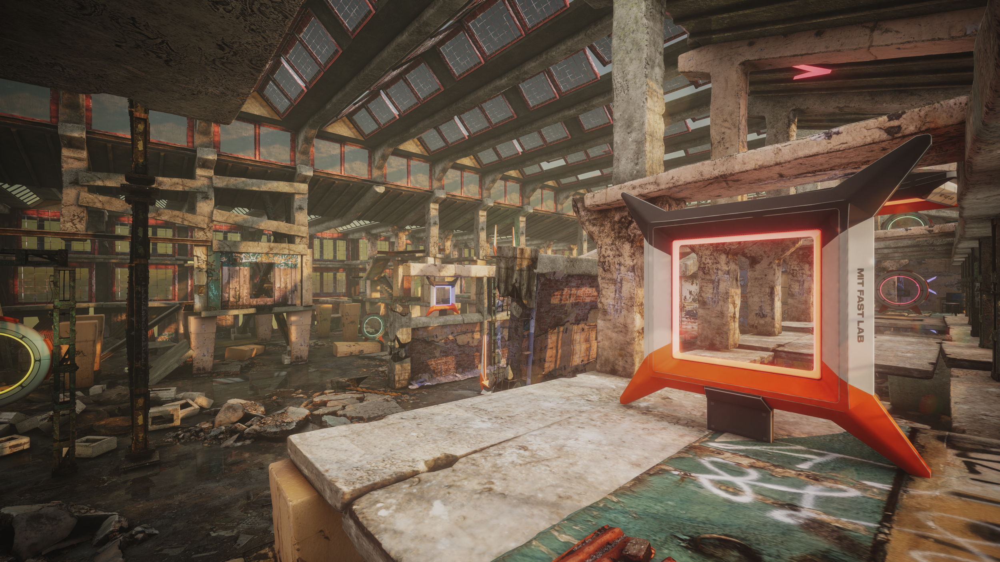
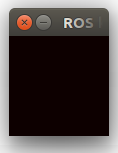

# FlightGoggles
A framework for photorealistic hardware-in-the-loop agile flight simulation using Unity3D and ROS.

[](https://youtu.be/e_3Yw0uPRKE)



## Quick Start Guide

### Prerequisites and testing setup

#### Hardware

We have tested this project on two different setups:
High end Desktop computer with:
- Processor: Intel i9 extreme (i9-7980XE)
- RAM: 32Gb
- GPU: Titan V

AWS instances:
- p3.2xlarge
- g3s.xlarge

For teleoperation, we use a Logitech Gamepad F310 or a keyboard. Other gamepads can work, but you must remap the buttons and pots in the universal_teleop configuration node. 

For running the renderer in Ubuntu Linux, NVidia driver version `>=384.130` is required.


#### Software

We use Ubuntu 16.04 and ROS Kinetic exclusively

For running the renderer in Ubuntu Linux, NVidia driver version `>=384.130` is required.

Prior to installing our software make sure to have ROS and Catkin installed:
http://wiki.ros.org/kinetic/Installation/Ubuntu
```
sudo apt install python-rosinstall python-rosinstall-generator python-wstool build-essential
sudo apt-get install python-catkin-tools
sudo apt install python-wstool
pip install catkin_pkg
```

### Install FlightGoggles Simulation Framework on Local Machine

```bash
# Setup catkin workspace
mkdir -p ~/catkin_ws/src
cd ~/catkin_ws/
catkin init
# Add workspace to bashrc.
echo 'source ~/catkin_ws/devel/setup.bash' >> ~/.bashrc
cd src
wstool init
# Install FlightGoggles nodes and deps from rosinstall file
wstool merge https://raw.githubusercontent.com/mit-fast/FlightGoggles/master/flightgoggles.rosinstall
wstool merge flightgoggles.rosinstall
wstool update
cd ../
# Install required libraries.
rosdep install --from-paths src --ignore-src --rosdistro kinetic -y
# Install external libraries for flightgoggles_ros_bridge
sudo apt install -y libzmqpp-dev libeigen3-dev
# Install dependencies for flightgoggles renderer
sudo apt install -y libvulkan1 mesa-vulkan-drivers vulkan-utils
# Build nodes
catkin build
# Refresh workspace
source ~/.bashrc
```

### Updating to latest version of FlightGoggles renderer

The FlightGoggles renderer is still under active development. Thus, periodic updates are expected.
To update the FlightGoggles renderer to the latest version, please run the following commands:

```bash
# Pull new flightgoggles source code
cd ~/catkin_ws/src/flightgoggles
git pull
# Force flightgoggles to redownload binary at build time
catkin clean flightgoggles
catkin build
```

### Running the FlightGoggles Simulation Environment

```bash
# To run example environment with joystick/keyboard teleoperation
roslaunch flightgoggles teleopExample.launch
# To run core simulation framework without teleoperation
roslaunch flightgoggles core.launch
```

**NOTE:** The FlightGoggles beta might take up to 30 seconds to load. In the development build, asset loading to the GPU has not yet been optimized. If you'd like to keep the FlightGoggles render alive between tests to avoid waiting for the renderer to load, you can run the following:

```bash
# In terminal 1, leave the following running:
rosrun flightgoggles FlightGoggles.x86_64

# In terminal 2, you can run and exit various launch files with the use_external_renderer flag.
# To run example environment with joystick/keyboard teleoperation
roslaunch flightgoggles teleopExample.launch use_external_renderer:=1
# To run core simulation framework without teleoperation
roslaunch flightgoggles core.launch use_external_renderer:=1
```

Users may also run any of three different challenges by running:
```
roslaunch flightgoggles reporter.launch level:=easy
roslaunch flightgoggles reporter.launch level:=medium
roslaunch flightgoggles reporter.launch level:=hard
```
The challenges are completed if the drone passes through each of the gates that are part of the challenge in order.

These launch files run a reporter node in addition to the rest of the software that reports when the drone crosses the challenge gates and the overall time it took.

Feel free to edit the yaml files on `flightgoggles/config/challenges` to setup your own challenges


### Default Controls 

For human teleoperation, a Logitech F310 controller or normal QWERTY keyboard can be used. Any of the two methods can 
be used using the following roslaunch command:
```bash
roslaunch flightgoggles teleopExample.launch
```

To use a keyboard for teleoperation, the keyboard controller window (see figure below) must be focused. 
`spacebar` must be held to enable keyboard control. Similar to Mode 2 RC Controllers, left hand `ASDW` keys control thrust
and yaw rate. The right hand `JKLI` keys control roll and pitch rate. 



For joystick control, the joystick mode switch should be in mode `D`. To enabled joystick control, `LT` should be held.
Similar to Mode 2 RC Controllers, the left hand joystick controls thrust
and yaw rate. The right hand joystick controls roll and pitch rate. 

Note: Collisions do not reset the simulator and the simulator stops when the drone has collided. To fly around without colliders enabled for the purpose of exploring the environment, colliders can be disabled by setting ignore_collisions to true in the launch file or passing it as an argument to the launch file without editing the launch file.  

### Running Flightgoggles in AWS (or other headless Linux servers)

These instructions are derived from [here](https://towardsdatascience.com/how-to-run-unity-on-amazon-cloud-or-without-monitor-3c10ce022639)

Start by spinning up an EC2 instance. We recommend the following configuration:

Instance: `p3.2xlarge` or `g3s.xlarge`. `p3.2xlarge` is preferred, but `g3s.xlarge` is usable (has lower framerate).
Amazon Base Image: `ami-0826e0d47dd8eebf6 ( `https://aws.amazon.com/marketplace/pp/B077GCZ4GR`)

Now we need to set up a virtual display. Install Xorg:

```bash
sudo apt-get install xserver-xorg-core
```

Figure out the BusID of the GPU:

```bash
nvidia-xconfig --query-gpu-info
```

On a g3s.xlarge, the result is `PCI:0:30:0`

Now we need to configure Xorg. Run this command (replace the BusID, if appropriate):

```bash
sudo nvidia-xconfig -a --allow-empty-initial-configuration --virtual=3200x1800 --busid PCI:0:30:0
```

Read the output. If it says that it wrote the file `XF86Config`, we need to rename it manually:

```bash
sudo mv /etc/X11/XF86Config /etc/X11/xorg.conf
```

Now reboot. Once restarted, run the following commands:

```bash
export DISPLAY=:0
sudo X :0 &
```

These commands need to be run after every reboot.

To test that graphical applications run now, try to run `glxgears`. If the output looks something like `??? frames in 5.0 seconds = ??? FPS`, then it's working. Follow the install instructions above to get flightgoggles running.

If you would like to see the output of the simulation locally, you will need to set the `ROS_MASTER_URI` and `ROS_IP` environment variables appropriately on your EC2 instance and on your local machine. `ROS_MASTER_URI` should be set to `http://<your-ec2-ip>:11311` on both machines. `ROS_IP` should be set to the IP address of the device that it is being set on. Note that each EC2 instance will have 2 ip addresses - set `ROS_IP` to the external IP address. Also be sure to open up inbound and outbound ports on the EC2 instance through the web portal. Now, if you launch flightgoggles on the remote instance and start up `rqt` locally, you should be able to see the output of flightgoggles on your local machine.

## Citation
If you find this work useful for your research, please cite:
```bibtex
@inproceedings{sayremccord2018visual,
  title={Visual-inertial navigation algorithm development using photorealistic camera simulation in the loop},
  author={Sayre-McCord, Thomas and
  Guerra, Winter and
  Antonini, Amado and
  Arneberg, Jasper and
  Brown, Austin and
  Cavalheiro, Guilherme and
  Fang, Yajun and
  Gorodetsky, Alex and
  McCoy, Dave and
  Quilter, Sebastian and
  Riether, Fabian and
  Tal, Ezra and
  Terzioglu, Yunus and
  Carlone, Luca and
  Karaman, Sertac},
  booktitle={2018 IEEE International Conference on Robotics and Automation (ICRA)},
  year={2018}
}
```
## Papers using this work
```bibtex
@inproceedings{antonini2018blackbird,
  title={The Blackbird Dataset: A large-scale dataset for UAV perception in aggressive flight},
  author={Antonini, Amado and Guerra, Winter and Murali, Varun and Sayre-McCord, Thomas and Karaman, Sertac},
  booktitle={International Symposium on Experimental Robotics, {ISER} 2018, Buenos Aires,
               Argentina, November 5-8, 2018.},
  year={2018}
}
```
Blackbird Dataset: [Paper](https://arxiv.org/abs/1810.01987) [Website](https://github.com/mit-fast/Blackbird-Dataset)

## Core Contributers

```
Winter Guerra
Ezra Tal
Varun Murali
Sebastian Quilter
John Aleman
Sertac Karaman
```
